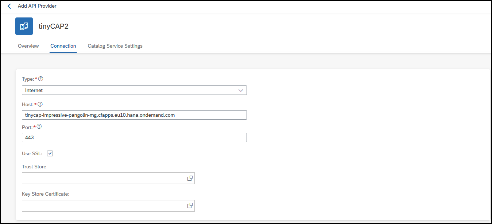
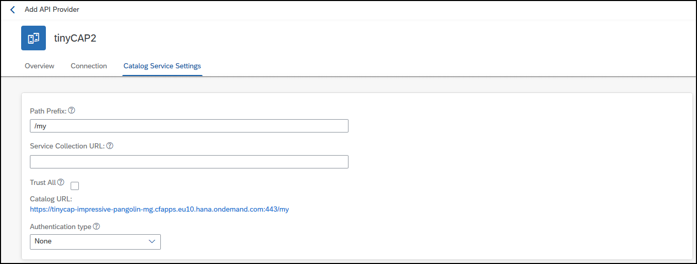
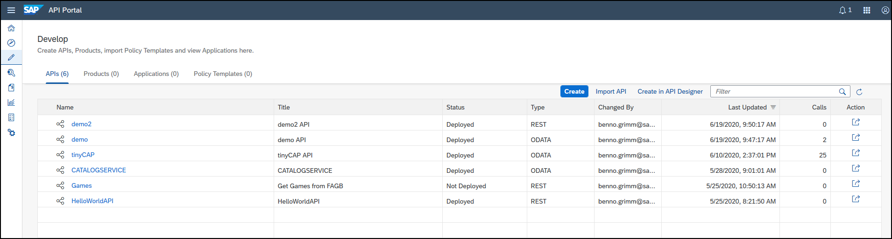
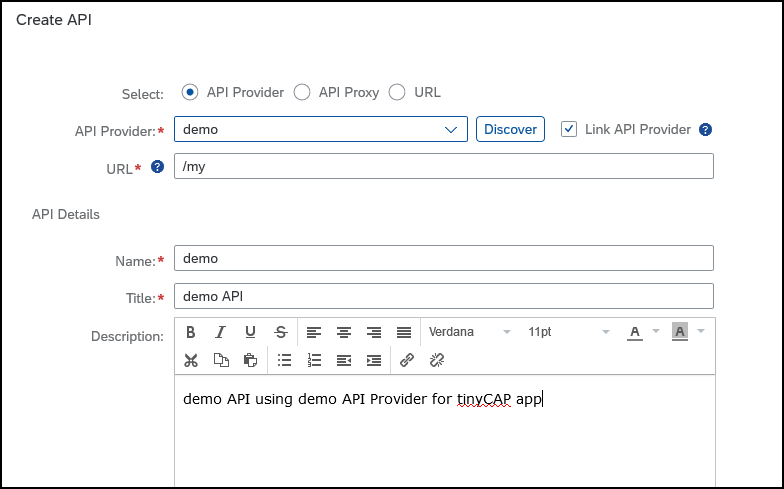
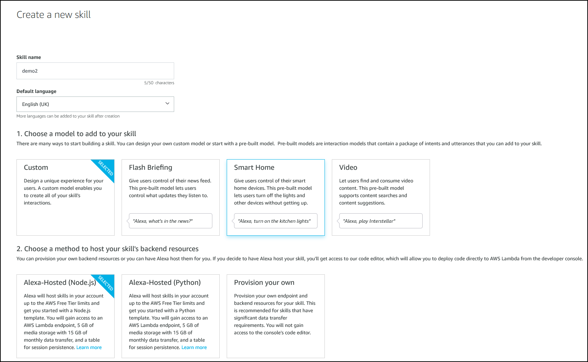

# Show 'n Tell
SAP API Management & Hyperscaler

## Introduction
This mini tutorial will demonstrate how to use SAP API Management to access and manage APIs of your systems. Using a simple example application hosted on Cloud Platform we will demonstrate the basics of API Management and how to leverage its advantages. For that we will create a simple AWS hosted Alexa skill, although here anything that can run code and has access to the internet should work just as fine.

## Prerequisites
You will need the following:
- An Amazon developer account on [Amazon's developer website](https://developer.amazon.com)
- An active SAP Cloud Platform with [API Management subscription](https://blogs.sap.com/2020/06/22/part-1-enable-sap-cloud-platform-api-management-in-cloud-foundry-environment/) enabled
- A system with an exposed API that can be accessed remotely
  - The quickest way to get access to such a system is probably by following [Marius Obert's tiny CAP project](https://blogs.sap.com/2020/05/28/cloudfoundryfun-12-create-a-tiny-cap-project/) guide or if you are really short on time simply downloading & deploying [the tinyCAP](https://github.tools.sap/D056949/tinyCAP) with <code>cf push tinyCAP</code> (just make sure you are in the right folder and don't waste half a day trying to figure out what's going on).
- [Cloud Foundry CLI](https://chocolatey.org/packages/cloudfoundry-cli)
- (somewhat optional) [Node.js and npm](https://docs.npmjs.com/downloading-and-installing-node-js-and-npm) and some basic understanding of JavaScript (Sorry Max)
  
With that all the necessary Prerequisites should be fulfilled.

## Configuring SAP API Management
### Setting up the API Provider
First we will configure an API Provider for the tinyCAP app you (hopefully) set up as part of the prerequisites. On the API Portal navigate to <b>Configure</b>. It should look something like this, although if this is your first time using the API Portal, no API Providers will be listed.

To create a new API Provider, which will act as a middle layer between our tinyCAP app and our Alexa skill, click on <b>Create</b>. You will first be asked to provide a name and an (optional) description, for which you can choose whatever you like. Once that is done advance to <b>Connection</b>, where the interesting bits of setting up the API Provider happen. Enter the following attributes as your connection settings:

|Property|Value|
|---|---|
|Type|Internet|
|Host|(your application host)|
|Port|443|
|Use SSL|true|
|Trust Store||
|Key Store Certificate||



If you don't know the host of your application you can use the Cloud Foundry CLI and run the <code>cf apps</code> command, which will display an overview of all your deployed apps and their hosts.


I have yet to find a reliable way to find out the <b>Port</b> of my applications, but <b>443</b> usually works for HTTPS applications.
Now you should be left with a similar setup to this, just with a different host.

All that's left to do is configuring the <b>Path Prefix</b> under <b> Catalog Service Settings</b>. If you already played around a little with the tinyCAP app, you will know that a catalog of all available recourses can be accessed under [<code> https://YOUR-APPLICATION-URL/my</code>](). For now we will enter 

|Property|Value|
|---|---|
|Path Prefix|<code>/my</code>|
|Service Collection URL||
|Trust All|false|
|Authentification Type|None|

To check whether your configuration works click on the URL provided under <b>Catalog URL</b> which should take you straight to an overview of all available recourses of your tinyCAP app in JSON format. You can save and Test you Connection now.


### Setting up the API
To expose our previously configured API Provider we now need to create an API. On the API Portal navigate to <b>Develop</b>. Once again if this is your first time working with the API Portal no APIs will be listed here.

Click on <b> Create</b>. You will be prompted with a pop-up requiring you to fill out all the necessary details to set up your API. 
Fill out the required fields as shown below

|Property|Value|
|---|---|
|Select|API Provider|
|API Provider|(name of your API Provider)|
|Link API Provider|true|
|URL|<code>/my</code>|
|Name|demo|
|Title||
|Description ||
|Host Alias|(choose one of the options)|
|API Base Path||
|Service Type|REST|

The <b>Host Alias</b> and <b>API Base Path</b> will determine the URL through which the APi can be accessed. The Host Alias should be filled out automatically, as for the Base Path just enter something simple like <code>/demo</code>. Make sure to Save and Deploy your API before continuing.




To test whether the setup of your API has been successful, click in the API you just created and open the <b>API Proxy URL</b> in your webbrowser. It should display the same data as the <b>Catalog URL</b> from the last step.

## What do we have so far?
We are <em>almost</em> done with the API part of this (Blog Post? Tutorial? Show 'n Tell??). Why almost? We already showed that we can access the data in our webbrowser through the API we created. To demonstrate the last thing that is preventing us from simply making an <code>HTTP GET</code> we will set up a simple node application like this
```javascript
/**
 * Test APIs using Axios requests
 */
const axios = require('axios');

(async function () {
    const baseURL = "";

    let output;
    try {
        // Get resources from API and format as readable string
        const response = await axios.get(baseURL);
        output = `Available resources are: ${response.data.value.map(entity => entity.name).join(", ")}.`;
    } catch(e) {
        // Error handling
        console.error(e);
        output = "An error occurred";
    }

    console.log(output);

})();
```
Note that we make use of the Axios npm package, so make sure to run <code>npm init</code> and <code>npm install axios</code>. First we will need to set the URL we want to make a request to. To check if our code is working we will first make a request to the tinyCAP app directly, without using API Management. For me that means setting
```javascript
const baseURL = "https://tinycap-impressive-pangolin-mg.cfapps.eu10.hana.ondemand.com/my";
```
Running your programm using node should output the same data you can see when opening the URL in your webbrowser. Great, so that works! Now let's try the same thing with the API we set up. Set <code>baseURL</code> to whatever you configured in the previous step. For me that is
```javascript
const baseURL = "https://devrelations.test.apimanagement.eu20.hana.ondemand.com/demo";
```
Running the programm now will surprisingly result in a SSL Error <code>Unable to verify first certificate</code>. Looking for a [solution online](https://stackoverflow.com/questions/31673587/error-unable-to-verify-the-first-certificate-in-nodejs) suggests adding appropriate root certificates via the npm <code>ssl-root-cas</code> package, the solution however isn't quite as simple. to get the request working we <em> manually</em> need to add the PEM chain to node. In Firefox simply open the URL of your API and hit enter. Click on the small lock icon to the left of the URL bar and navigate to Connection Secure > Show connection Details > More Information. Under Security / Website Identity click on View Certificate. Under <b>Miscellaneous</b> you can download the PEM (chain). Save it in the same folder your node project is in. To add the PEM chain to our project we will update our code to look like the following:
```javascript
/**
 * Test APIs using Axios requests
 */
const axios = require('axios');

// Add PEM chain
require('ssl-root-cas').create().addFile("cert.pem");

(async function () {
    const baseURL = "";

    let output;
    try {
        // Get resources from API and format as readable string
        const response = await axios.get(baseURL);
        output = `Available resources are: ${response.data.value.map(entity => entity.name).join(", ")}.`;
    } catch(e) {
        // Error handling
        console.error(e);
        output = "An error occurred";
    }

    console.log(output);

})();
```
If you copy + paste this code make sure to adjust the file name baseURL accordingly. If we run this our programm now we will see the same data we can see in our webbrowser.

## Alexa Skill
First create a new skill on the [alexa developer console](https://developer.amazon.com/alexa/console/ask). Enter a Skill name of you liking and choose whatever flavour of English you prefer. Choose the Custom as your model and Alexa-Hosted (Node.js) as the backend hosting method, so we can apply what we learned earlier directly to our skill. If prompted whether you want to add a template to your skill, choose the Hello World template. Create your skill, this might take a while.


Under the <b>Build</b> tab, navigate on the left side to <b>Custom > Invocation</b> and choose a Skill invocation name. I'll be using "demo two" since I was too lazy to delete the fist one. Now navigate to <b>Custom > Intents</b>. Here you should see a list of a few Amazon default Intents, as well a template intent (e.g. HelloWorldIntent) if you chose to add a template to your skill while creating it. Click on <b>+ Add Intent</b>. Enter GetApiDataIntent as your Intent name and create your custom intent. (Ever wondered how to convert abbreviations consisting of multiple upper case characters into a camel case name ("API" or "Api")? Apparently there are some general [guidelines](https://docs.microsoft.com/en-us/previous-versions/dotnet/netframework-1.1/141e06ef(v=vs.71)?redirectedfrom=MSDN) by Microsoft.)

As a next step we need to enter sample utterances, which describe what the user might say to invoke the intent we just created. Since we want to access data, we will go with something like "show me my data" and "show me api data". You are free to choose additional or different utterances, just make sure you end up calling the correct intent(s), going with something too simple such as "show me data" might result in some default Amazon intents being called instead of yours. Make sure to save and build your model.

Now we will switch over to the code tab and add some custom code to make the intent behave.
First we need to add our new intent. Copy and paste this code snippet into the <code>index.js</code> file. Also make sure to export the handler at the bottom of the file.
```javascript
const GetApiDataIntentHandler = {
    // Check whether handler can handle request
    canHandle(handlerInput) {
        return Alexa.getRequestType(handlerInput.requestEnvelope) === 'IntentRequest'
            && Alexa.getIntentName(handlerInput.requestEnvelope) === 'GetApiDataIntent';
    },

    // Handle request, this is where the magic happens
    handle(handlerInput) {

        // Define alexa speech output
        const speakOutput = 'Inside API Data Intent';
        return handlerInput.responseBuilder
            .speak(speakOutput)
            .getResponse();
    }
};
```
Replace <code>exports.handler = ...</code> with
```javascript
exports.handler = Alexa.SkillBuilders.custom()
    .addRequestHandlers(
        LaunchRequestHandler,
        HelloWorldIntentHandler,
        GetApiDataIntentHandler,
        HelpIntentHandler,
        CancelAndStopIntentHandler,
        SessionEndedRequestHandler,
        IntentReflectorHandler, // make sure IntentReflectorHandler is last so it doesn't override your custom intent handlers
    )
    .addErrorHandlers(
        ErrorHandler,
    )
    .lambda();
```
Save and deploy your code. Switch to the <b>Test</b> tab to check whether everything is working up until now. You might need to switch to development mode to enable testing.


Great! Now let's add some functionality to our intent. Since we need the axios and ssl-root-cas npm packages we will add them to our skill's dependencies in the <code>package.json</code> file.
```
"axios": "^0.19.2",
"ssl-root-cas": "^1.3.1"
```
Upon Saving & deploying our skill all required dependencies from <code>package.json</code> will automatically be installed. First: certificates. In the lambda folder create a new file called <code>cert.pem</code> and copy & paste the content of your previously downloaded certificate chain into it.
Switch back to <code>index.js</code> and add to the top of the file.

```javascript
const axios = require('axios');
require('ssl-root-cas/latest').create().addFile("cert.pem");
```

Replace the <code>handle</code> function of the <code>getApiDataIntentHandler</code> with
```javascript
async handle(handlerInput) {
        
        const baseURL = "https://devrelations.test.apimanagement.eu20.hana.ondemand.com/tinycap";
        
        // Perform get request
        let output;
        try {
            // Get resources from API and format as readable string
            const response = await axios.get(baseURL);
            output = `Available resources are: ${response.data.value.map(entity => entity.name).join(", ")}.`;
        } catch(e) {
            // Error handling
            console.error(e);
            output = "An error occurred";
        }

        return handlerInput.responseBuilder
            .speak(output)
            .getResponse();
    }
```
and add 
```javascript
// Formats available resources for a given base string
// "Basestring: resource1, resource2, ..., resourceN."
function formatResourceCatalogResponse(baseString, resources){
    for(let i = 0; i < resources.length; i++) {
        baseString += `${resources[i].name + (i !== resources.length - 1 ? ", " : ".")}`;
    }
    return baseString;
}
```
to <code>index.js</code> to help with response formatting. Notice the <code>async</code> keyword for the <code>handle</code> function. Save and Deploy your changes. Testing our skill now should result in a nicely formatted output of available resources, and indeed that is the case.


A full download of the code used to run my Alexa skill can be found in [this repo](https://github.com/Grimmig18/alexa-api-management/tree/master/example-1). If you want to use this code feel free to import it into your environment, just make sure to adjust any names/strings to your needs.

## Further reading
- [Amazon's Alexa Whitepapers](https://developer.amazon.com/en-US/alexa/alexa-skills-kit/get-deeper/whitepapers)
- [Run and debug your skill locally](https://medium.com/coinmonks/how-to-develop-an-amazon-alexa-skill-using-node-js-b872ef5320b1)
